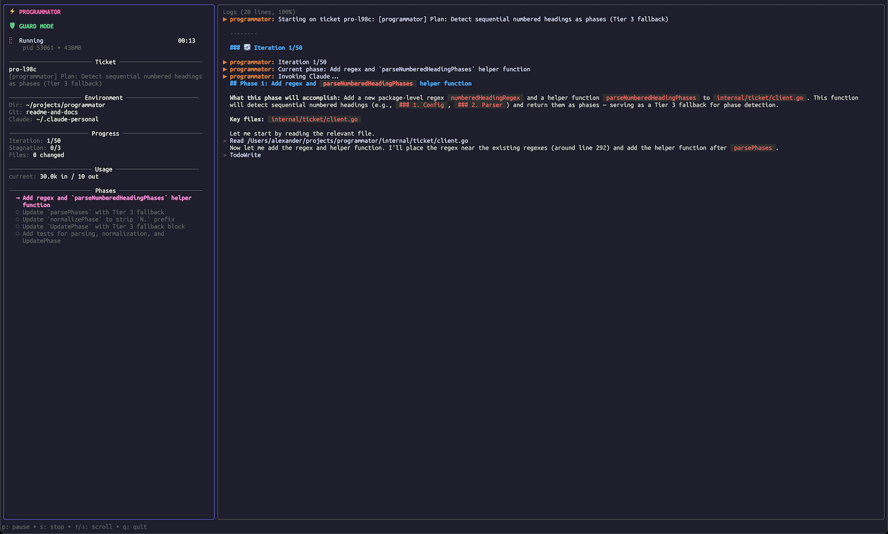

# Programmator

[](https://github.com/alexander-akhmetov/programmator/actions/workflows/ci.yml)
[](https://goreportcard.com/report/github.com/alexander-akhmetov/programmator)
[](LICENSE)

Autonomous Claude Code orchestrator that executes multi-task plans without supervision.

Claude Code is interactive — it requires you to watch, approve, and guide each step. For complex features spanning multiple tasks, this means hours of babysitting. As context fills up during long sessions, the model starts making mistakes and producing worse code.

Programmator splits work into isolated sessions with fresh context windows. Each task runs independently, gets reviewed by parallel agents, and can be auto-committed on completion with no supervision needed.

<details>
<summary>Screenshot</summary>



</details>

## Quick Start

**Requirements:**
- Go 1.25.6+
- [Claude Code](https://docs.anthropic.com/en/docs/claude-code) CLI
- [dcg](https://github.com/Dicklesworthstone/destructive_command_guard) (destructive command guard) — blocks dangerous shell commands during autonomous execution. Guard mode is enabled by default; without dcg installed, programmator falls back to experimental interactive permission dialogs.

```bash
go install github.com/alexander-akhmetov/programmator/cmd/programmator@latest
```

Write a plan file (`plan.md`):
```markdown
# Plan: Fix calculator bugs

## Validation Commands
- `go test ./...`

## Tasks
- [ ] Fix add() to return a + b instead of a - b
- [ ] Fix off-by-one error in loop
- [ ] Add missing nil check in User handler
```

Run it:
```bash
programmator start ./plan.md
```

Programmator picks up the first unchecked task, invokes Claude Code to complete it, marks it done, and moves to the next. After all tasks complete, it runs a multi-agent code review. When everything passes (or safety limits are hit), it stops.

## How It Works

Each iteration:
1. Reads the plan file and finds the first uncompleted task
2. Builds a prompt with the task context and instructions
3. Invokes Claude Code in a fresh session
4. Parses Claude's `PROGRAMMATOR_STATUS` output block (YAML with status, files changed, summary)
5. Updates the task checkbox and logs progress
6. Checks safety limits, then loops back

After all tasks are done, a [multi-agent review](#review) runs automatically.

## Plan Files

A plan file is a markdown file with checkbox tasks:

```markdown
# Plan: Feature Name

## Validation Commands
- `go test ./...`
- `golangci-lint run`

## Tasks
- [x] Task 1: Investigate current implementation and update plan.md (already completed, will be skipped)
- [ ] Task 2: Implement the feature
- [ ] Task 3: Add tests
- [ ] Task 4: Cleanup
```

- **Title**: First `# ` heading (optional `Plan:` prefix)
- **Validation Commands**: Run after each task completion (optional)
- **Tasks**: Checkbox items (`- [ ]` / `- [x]`) anywhere in the file

Create plans interactively — Claude analyzes your codebase and asks clarifying questions:

```bash
programmator plan create "Add authentication to the API"
```

## Review

After all tasks complete, programmator automatically runs a multi-agent code review. 9 agents run in parallel — each focused on a specific area (quality, security, implementation, testing, simplification, linting, CLAUDE.md compliance, and a Codex cross-check). Issues found are auto-fixed by Claude and re-reviewed, up to 3 iterations.

You can also run review standalone on any branch:

```bash
programmator review                       # review current branch vs main
programmator review --base develop        # review against a different base
```

## Commands

```bash
programmator start ./plan.md              # execute a plan
programmator start ./plan.md --auto-commit # with git workflow (branch + commits)
programmator start pro-1a2b               # execute a ticket
programmator review                       # review-only mode on current branch
programmator run "explain this codebase"  # run Claude with a custom prompt
programmator plan create "description"    # interactive plan creation
programmator status                       # show active sessions
programmator logs --follow                # tail the active log
programmator config show                  # show resolved config
```

`programmator run` is a lightweight wrapper around Claude Code — pass any prompt as an argument or pipe via stdin. Useful for one-off tasks that don't need plan tracking.

## Tickets

For persistent issue tracking, Programmator integrates with the external [ticket](https://github.com/wedow/ticket) CLI. Tickets are markdown files with YAML frontmatter and checkbox phases.

Source type is auto-detected from the argument: file paths → plan file, everything else → ticket ID.

## Safety Gates

- **Guard mode**: Blocks destructive shell commands via [dcg](https://github.com/Dicklesworthstone/destructive_command_guard) (enabled by default, disable with `--guard=false`). Use `--dangerously-skip-permissions` to bypass all permission checks entirely.
- **Max iterations**: Prevents runaway loops (default: 50)
- **Stagnation detection**: Exits if no files change for N iterations (default: 3)
- **Error repetition**: Exits if same error occurs 3 times
- **Timeout**: Kills Claude if a single invocation takes too long (default: 900s)
- **Ctrl+C**: Graceful stop after current iteration

## Auto Git Workflow

Opt-in via config or CLI flags:
- `--auto-commit`: Creates a `programmator/<slug>` branch, commits after each phase
- `--move-completed`: Moves completed plans to `plans/completed/`
- `--branch <name>`: Custom branch name

## Configuration

Programmator uses a unified YAML config with multi-level merge (highest priority last):

1. [Embedded defaults](internal/config/defaults/config.yaml) (built into binary)
2. Global config (`~/.config/programmator/config.yaml`)
3. Environment variables
4. Local config (`.programmator/config.yaml` in project directory)
5. CLI flags

See resolved values with `programmator config show`.

<details>
<summary>Config keys</summary>

| Key | Default | Description |
|-----|---------|-------------|
| `max_iterations` | `50` | Maximum loop iterations before forced exit |
| `stagnation_limit` | `3` | Exit after N consecutive iterations with no file changes |
| `timeout` | `900` | Seconds per Claude invocation |
| `claude_flags` | `""` | Additional flags passed to the `claude` command |
| `claude_config_dir` | `""` | Custom Claude config directory (empty = default) |
| `anthropic_api_key` | `""` | Anthropic API key passed to Claude (overrides env) |
| `ticket_command` | `tk` | Binary name for the ticket CLI (`tk` or `ticket`) |
| `logs_dir` | `""` | Directory for progress logs (default: `~/.programmator/logs`) |
| `git.auto_commit` | `false` | Auto-commit after each phase completion |
| `git.move_completed_plans` | `false` | Move completed plans to a `completed/` directory |
| `git.completed_plans_dir` | `""` | Directory for completed plans (default: `plans/completed`) |
| `git.branch_prefix` | `""` | Prefix for auto-created branches (default: `programmator/`) |
| `review.max_iterations` | `3` | Maximum review fix iterations |
| `review.parallel` | `true` | Run review agents in parallel |
| `review.agents` | see [defaults](internal/config/defaults/config.yaml) | Flat list of review agents with names and focus areas |

</details>

<details>
<summary>Environment variables</summary>

Each config key can also be set via environment variable with a `PROGRAMMATOR_` prefix (uppercase, dots become underscores):

| Variable | Default | Description |
|----------|---------|-------------|
| `PROGRAMMATOR_MAX_ITERATIONS` | 50 | Maximum loop iterations |
| `PROGRAMMATOR_STAGNATION_LIMIT` | 3 | Exit after N iterations with no file changes |
| `PROGRAMMATOR_TIMEOUT` | 900 | Seconds per Claude invocation |
| `PROGRAMMATOR_CLAUDE_FLAGS` | `""` | Flags passed to Claude |
| `PROGRAMMATOR_MAX_REVIEW_ITERATIONS` | 3 | Maximum review fix iterations |
| `PROGRAMMATOR_TICKET_COMMAND` | `tk` | Binary name for the ticket CLI (`tk` or `ticket`) |
| `PROGRAMMATOR_ANTHROPIC_API_KEY` | `""` | Anthropic API key passed to Claude |
| `TICKETS_DIR` | `~/.tickets` | Where ticket files live |
| `CLAUDE_CONFIG_DIR` | - | Custom Claude config directory (passed to Claude subprocess) |

</details>

<details>
<summary>Prompt templates</summary>

Prompts are customizable via Go `text/template` files. Override any prompt by placing a file in:
- `~/.config/programmator/prompts/` (global)
- `.programmator/prompts/` (per-project)

Available templates: `phased.md`, `phaseless.md`, `review_first.md`, `plan_create.md`. See [prompt template docs](docs/prompt_templates.md) for variables and examples.

</details>

## Documentation

- [Orchestration flow](docs/orchestration.md) — detailed walkthrough of execution, review, and plan creation
- [Prompt templates](docs/prompt_templates.md) — override chain, template variables, customization
- [E2E tests](docs/e2e_tests.md) — manual integration tests

## Development

```bash
go build ./...                # Build
go test ./...                 # Run tests
go test -race ./...           # Run tests with race detector
golangci-lint run             # Lint

# E2E test prep (creates toy projects in /tmp)
make e2e-prep                 # Plan-based run
make e2e-review               # Review mode
make e2e-plan                 # Interactive plan creation
```

## Releasing

Push a git tag to trigger a GitHub Actions release via GoReleaser:

```bash
git tag v1.0.0
git push origin v1.0.0
```

Binaries are published for linux/darwin (amd64/arm64).
