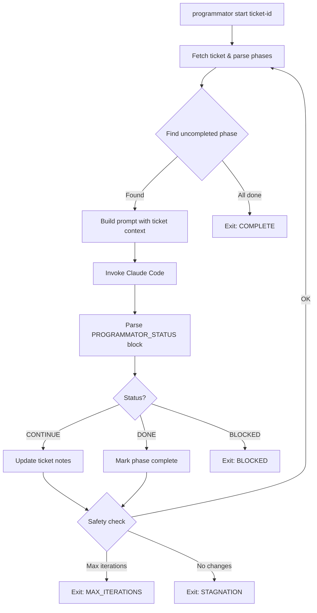

# Programmator

> [!WARNING]
> YOLO alert! By default, Programmator runs Claude Code with an experimental permissions system check. You can also run it with `--dangerously-skip-permissions`, which allows autonomous file modifications without confirmation prompts, but, as the name suggests, is dangerous.

Autonomous Claude Code loop orchestrator driven by tickets or plan files.

## Overview

Programmator orchestrates autonomous Claude Code sessions using either:
- **Tickets**: Integration with the external `ticket` CLI for persistent issue tracking
- **Plan files**: Lightweight markdown files for standalone tasks

Both define the work via checkbox phases. Programmator loops through phases until all are complete or safety limits are reached.

## Installation

```bash
brew tap alexander-akhmetov/tools git@github.com:alexander-akhmetov/homebrew-tools.git
brew install alexander-akhmetov/tools/programmator
```

Or build from source:

```bash
go install ./cmd/programmator
```

## Usage

```bash
# Start working on a ticket
programmator start <ticket-id>

# Start working on a plan file
programmator start ./docs/plan.md

# Start with specific working directory
programmator start <ticket-id> -d /path/to/project

# Limit iterations
programmator start <ticket-id> -n 10

# Auto-commit after each phase and create a branch
programmator start ./plan.md --auto-commit

# Show active sessions
programmator status

# View logs for a ticket/plan
programmator logs <ticket-id>

# Tail the active log in real-time
programmator logs --follow

# Create a plan interactively via Claude Q&A
programmator plan create "Add authentication to the API"

# Show resolved configuration
programmator config show

# Print version
programmator --version
```

Programmator auto-detects the source type:
- File paths (contain `/`, end with `.md`, or exist on disk) → Plan file
- Everything else → Ticket ID

## Source Formats

### Tickets

Requires the `ticket` CLI:
```bash
brew tap alexander-akhmetov/tools git@github.com:alexander-akhmetov/homebrew-tools.git
brew install alexander-akhmetov/tools/ticket
```

See `templates/ticket.md` for the expected format. Key elements:
- **Design section**: Contains `- [ ]` checkboxes for phases
- **Phases**: Programmator works through them sequentially
- **Notes**: Progress is logged here automatically

### Plan Files

Standalone markdown files with checkbox tasks. No external dependencies.

```markdown
# Plan: Feature Name

## Validation Commands
- `go test ./...`
- `golangci-lint run`

## Tasks
- [ ] Task 1: Investigate current implementation
- [ ] Task 2: Implement the feature
- [ ] Task 3: Add tests
- [x] Task 4: Cleanup (completed)
```

Key elements:
- **Title**: First `# ` heading (optional `Plan:` prefix)
- **Validation Commands**: Commands run after each task completion (optional)
- **Tasks**: Checkbox items (`- [ ]` / `- [x]`) anywhere in the file

## Configuration

Programmator uses a unified YAML config with multi-level merge:

1. **Embedded defaults** (built into binary)
2. **Global config** (`~/.config/programmator/config.yaml`)
3. **Environment variables** (legacy support)
4. **Local config** (`.programmator/config.yaml` in project directory)
5. **CLI flags** (highest priority)

On first run, a default config file is created at `~/.config/programmator/config.yaml`.

Show resolved configuration with source annotations:
```bash
programmator config show
```

### Environment Variables (Legacy)

| Variable | Default | Description |
|----------|---------|-------------|
| `PROGRAMMATOR_MAX_ITERATIONS` | 50 | Maximum loop iterations |
| `PROGRAMMATOR_STAGNATION_LIMIT` | 3 | Exit after N iterations with no file changes |
| `PROGRAMMATOR_TIMEOUT` | 900 | Seconds per Claude invocation |
| `PROGRAMMATOR_CLAUDE_FLAGS` | `--dangerously-skip-permissions` | Flags passed to Claude |
| `TICKETS_DIR` | `~/.tickets` | Where ticket files live |
| `CLAUDE_CONFIG_DIR` | - | Custom Claude config directory (passed to Claude subprocess) |

### Prompt Templates

Prompts are customizable via `text/template` files. Override any prompt by placing a file in:
- `~/.config/programmator/prompts/` (global)
- `.programmator/prompts/` (per-project)

Available templates: `phased.md`, `phaseless.md`, `review_fix.md`, `plan_create.md`.

### Auto Git Workflow

Opt-in via config or CLI flags:
- `--auto-commit`: Creates a `programmator/<slug>` branch, commits after each phase
- `--move-completed`: Moves completed plans to `plans/completed/`
- `--branch <name>`: Custom branch name

## How It Works



1. Programmator reads the ticket and finds the first uncompleted phase
2. Builds a prompt with ticket context and instructions
3. Invokes Claude Code in autonomous mode
4. Parses Claude's `PROGRAMMATOR_STATUS` output block
5. Updates the ticket phase checkboxes and adds progress notes
6. Repeats until all phases complete or safety limits reached

## Safety Gates

- **Max iterations**: Prevents runaway loops
- **Stagnation detection**: Exits if no files change for N iterations
- **Error repetition**: Exits if same error occurs 3 times
- **Timeout**: Kills Claude if it takes too long
- **Ctrl+C**: Graceful stop after current iteration

## Development

```bash
# Build
go build ./...

# Run tests
go test ./...

# Run single package tests
go test ./internal/parser -v

# Run tests with race detector
go test -race ./...

# Lint and format
gofmt -l .        # Check formatting
gofmt -w .        # Auto-format
go vet ./...      # Static analysis

# E2E test prep (creates toy projects in /tmp)
make e2e-prep      # Plan-based run
make e2e-review    # Review mode
make e2e-plan      # Interactive plan creation
```

## Releasing

Push a git tag to trigger a GitHub Actions release via GoReleaser:

```bash
git tag v1.0.0
git push origin v1.0.0
```

Binaries are published for linux/darwin (amd64/arm64) and a Homebrew formula is updated automatically.
