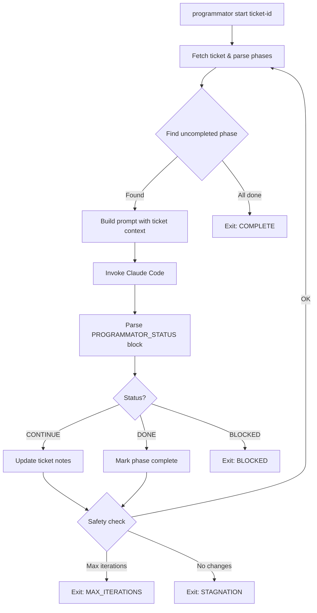

# Programmator

Ticket-driven autonomous Claude Code loop orchestrator.

> **Note:** Programmator requires the `ticket` CLI to be installed and configured first:
> ```bash
> brew tap alexander-akhmetov/tools git@github.com:alexander-akhmetov/homebrew-tools.git
> brew install alexander-akhmetov/tools/ticket
> ```
> Programmator works only with tickets.
> For more info, see https://github.com/alexander-akhmetov/dotfiles/tree/main/claude/skills

## Overview

Programmator uses your existing ticket system as its backbone for orchestrating autonomous Claude Code sessions. A ticket defines the work, phases track progress, and the loop continues until all phases are complete.

## Installation

```bash
uv sync
```

## Usage

```bash
# Start working on a ticket
programmator start <ticket-id>

# Start with specific working directory
programmator start <ticket-id> -d /path/to/project

# Limit iterations
programmator start <ticket-id> -n 10

# Show active sessions
programmator status

# View logs for a ticket
programmator logs <ticket-id>
```

## Ticket Format

See `templates/ticket.md` for the expected format. Key elements:

- **Design section**: Contains `- [ ]` checkboxes for phases
- **Phases**: Programmator works through them sequentially
- **Notes**: Progress is logged here automatically

Example:
```markdown
## Design
- [ ] Phase 1: Investigation - understand current implementation
- [ ] Phase 2: Implementation - add the new feature
- [ ] Phase 3: Testing - write and run tests
- [x] Phase 4: Cleanup - ensure code quality
```

## Configuration

Environment variables:

| Variable | Default | Description |
|----------|---------|-------------|
| `PROGRAMMATOR_MAX_ITERATIONS` | 50 | Maximum loop iterations |
| `PROGRAMMATOR_STAGNATION_LIMIT` | 3 | Exit after N iterations with no file changes |
| `PROGRAMMATOR_TIMEOUT` | 900 | Seconds per Claude invocation |
| `PROGRAMMATOR_CLAUDE_FLAGS` | `--dangerously-skip-permissions` | Flags passed to Claude |
| `TICKETS_DIR` | `~/.tickets` | Where ticket files live |

## How It Works



1. Programmator reads the ticket and finds the first uncompleted phase
2. Builds a prompt with ticket context and instructions
3. Invokes Claude Code in autonomous mode
4. Parses Claude's `PROGRAMMATOR_STATUS` output block
5. Updates the ticket phase checkboxes and adds progress notes
6. Repeats until all phases complete or safety limits reached

## Safety Gates

- **Max iterations**: Prevents runaway loops
- **Stagnation detection**: Exits if no files change for N iterations
- **Error repetition**: Exits if same error occurs 3 times
- **Timeout**: Kills Claude if it takes too long
- **Ctrl+C**: Graceful stop after current iteration

## Development

```bash
# Run tests
uv run pytest -v

# Run single test
uv run pytest tests/test_response_parser.py -v

# Lint and format
uv run ruff format --check src tests   # Check formatting
uv run ruff check src tests            # Lint
uv run ty check src tests              # Type check

# Auto-fix
uv run ruff format src tests           # Auto-format
uv run ruff check --fix src tests      # Auto-fix lint issues
```
