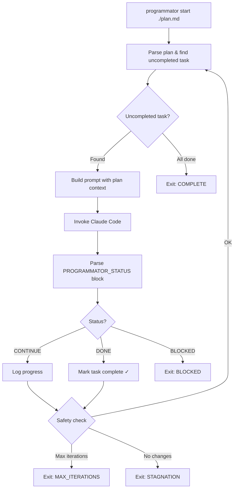

# Programmator

Autonomous Claude Code loop orchestrator driven by plan files or tickets.

## Quickstart

Install:
```bash
brew tap alexander-akhmetov/tools git@github.com:alexander-akhmetov/homebrew-tools.git
brew install alexander-akhmetov/tools/programmator
```

Or build from source:
```bash
go install ./cmd/programmator
```

Write a plan file (`plan.md`):
```markdown
# Plan: Fix calculator bugs

## Validation Commands
- `go test ./...`

## Tasks
- [ ] Fix add() to return a + b instead of a - b
- [ ] Fix off-by-one error in loop
- [ ] Add missing nil check in User handler
```

Run it:
```bash
programmator start ./plan.md
```

Programmator picks up the first unchecked task, invokes Claude Code to complete it, marks it done, and moves to the next one. When all tasks are checked off (or safety limits are hit), it stops.

## How It Works



Each iteration:
1. Reads the source (plan file or ticket) and finds the first uncompleted task
2. Builds a prompt with the task context and instructions
3. Invokes Claude Code in autonomous mode
4. Parses Claude's `PROGRAMMATOR_STATUS` output block (YAML with status, files changed, summary)
5. Updates the task checkbox and logs progress
6. Checks safety limits, then loops back

## Plan Files

The simplest way to use Programmator. A plan file is a markdown file with checkbox tasks:

```markdown
# Plan: Feature Name

## Validation Commands
- `go test ./...`
- `golangci-lint run`

## Tasks
- [ ] Task 1: Investigate current implementation
- [ ] Task 2: Implement the feature
- [ ] Task 3: Add tests
- [x] Task 4: Cleanup (already completed, will be skipped)
```

- **Title**: First `# ` heading (optional `Plan:` prefix)
- **Validation Commands**: Run after each task completion (optional)
- **Tasks**: Checkbox items (`- [ ]` / `- [x]`) anywhere in the file

You can also create plans interactively — Claude analyzes your codebase and asks clarifying questions to build the plan for you:

```bash
programmator plan create "Add authentication to the API"
```

## Tickets

For persistent issue tracking, Programmator integrates with the external `ticket` CLI:

```bash
brew tap alexander-akhmetov/tools git@github.com:alexander-akhmetov/homebrew-tools.git
brew install alexander-akhmetov/tools/ticket
```

Tickets are markdown files with YAML frontmatter. Phases are checkboxes in a Design section:
```markdown
## Design
- [ ] Phase 1: Investigation
- [x] Phase 2: Implementation (completed)
```

Programmator auto-detects the source type from the argument:
- File paths (contain `/`, end with `.md`, or exist on disk) → Plan file
- Everything else → Ticket ID

```bash
programmator start ./plan.md       # plan file
programmator start pro-1a2b        # ticket
```

## Monitoring

```bash
# Show active sessions
programmator status

# View logs for a source (ticket or plan)
programmator logs <source-id>

# Tail the active log in real-time
programmator logs --follow
```

Every run writes a persistent log to `~/.programmator/logs/` with timestamped entries per iteration.

## Safety Gates

- **Max iterations**: Prevents runaway loops (default: 50)
- **Stagnation detection**: Exits if no files change for N iterations (default: 3)
- **Error repetition**: Exits if same error occurs 3 times
- **Timeout**: Kills Claude if a single invocation takes too long (default: 900s)
- **Ctrl+C**: Graceful stop after current iteration

## Configuration

Programmator uses a unified YAML config with multi-level merge (highest priority last):

1. Embedded defaults (built into binary)
2. Global config (`~/.config/programmator/config.yaml`)
3. Environment variables
4. Local config (`.programmator/config.yaml` in project directory)
5. CLI flags

On first run, a default config file is created at `~/.config/programmator/config.yaml`. See resolved values with:

```bash
programmator config show
```

### Environment Variables

| Variable | Default | Description |
|----------|---------|-------------|
| `PROGRAMMATOR_MAX_ITERATIONS` | 50 | Maximum loop iterations |
| `PROGRAMMATOR_STAGNATION_LIMIT` | 3 | Exit after N iterations with no file changes |
| `PROGRAMMATOR_TIMEOUT` | 900 | Seconds per Claude invocation |
| `PROGRAMMATOR_CLAUDE_FLAGS` | `--dangerously-skip-permissions` | Flags passed to Claude |
| `TICKETS_DIR` | `~/.tickets` | Where ticket files live |
| `CLAUDE_CONFIG_DIR` | - | Custom Claude config directory (passed to Claude subprocess) |

### Prompt Templates

Prompts are customizable via Go `text/template` files. Override any prompt by placing a file in:
- `~/.config/programmator/prompts/` (global)
- `.programmator/prompts/` (per-project)

Available templates: `phased.md`, `phaseless.md`, `review_fix.md`, `plan_create.md`.

### Auto Git Workflow

Opt-in via config or CLI flags:
- `--auto-commit`: Creates a `programmator/<slug>` branch, commits after each phase
- `--move-completed`: Moves completed plans to `plans/completed/`
- `--branch <name>`: Custom branch name

## Development

```bash
go build ./...                # Build
go test ./...                 # Run tests
go test -race ./...           # Run tests with race detector
go test ./internal/parser -v  # Single package
golangci-lint run             # Lint
go vet ./...                  # Static analysis

# E2E test prep (creates toy projects in /tmp)
make e2e-prep                 # Plan-based run
make e2e-review               # Review mode
make e2e-plan                 # Interactive plan creation
```

## Releasing

Push a git tag to trigger a GitHub Actions release via GoReleaser:

```bash
git tag v1.0.0
git push origin v1.0.0
```

Binaries are published for linux/darwin (amd64/arm64) and a Homebrew formula is updated automatically.
